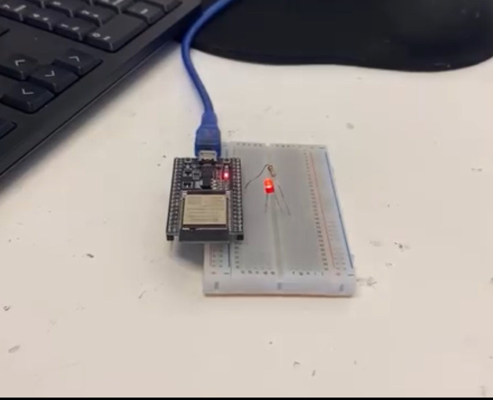

#Segundo Proyecto

###Nombre del proyecto: MCU 101

###Autores
- Barrientos Miguel Leonardo
- Zermeño Cervantes Rodrigo

###Asignatura: Introducción a la Mecatronica

###Fecha: 12 de Septiembre del 2025

###Descripción
Con los componentes electronicos que teniamos (Arduino ,Jumpers,Protoboar,etc)tenemos que lograr que un foco led se encienda y se apague programando nuestro arduino desde la computadora.

##Objetivos
###General
En este segundo proyecto  de "Introducción a la Mecatronica" pretendiamos lograr realizar un circuito programando  un "Arduino"  para que un led se encendiara y apagara dependiendo de las indicaciones del codigo que diseñamos durante la clase.
###Especificos
-OE1:Como objetivo especifico,ambos buscamos tener un desempeño superior al del primer proyecto,nuevamente tuvimos la mentalidad del poder ampliar nuestros conocimientos para tener un mejor desempeño en los proyectos que realizaremos en un futuro.
##Alcance y Exclusiones
 -**Incluye**: Todos los codigos que utilizamos para cada uno de los circuitos que realizamos junto a fotografias de cada circuito

 -**No Incluye**: foto especifica de los materiales ocupados, sin embargo es posible visualizarlos en las fotografías.

##Procedimiento 1
Lo primero que hicimos fue revisar todo nuestro material  de de trabajo y con una breve introducion de como utilizar nuestro arduino realizamos un circuito en el cual estaria conectado a nuestro principal material de trabajo el "Arduino",acto siguiente realizamos un codigo el cual su principal fucnion era encender y apagar nuestro led con un pequeño "delay" para lograr precibir  el momento en del encendido y apagado del led

#Codigo 1:

const int led=33;  // Puerto al que esta conectado el led
 
void setup(){

   Serial.begin(11520)         ; //Numero de serie de nuestro arduino

     pinMode(led, OUTPUT);
 
 }
 
void loop() {            

     digitalWrite(led,1); // LED ENCENDIDO

    delay(1000);  //retraso del encendito y apagado del led

     digitalWrite(led,0); // LED APAGADO

        delay(1000);
 
  }

Captura de pantalla del video en el momento en que el foco estaba apagado.

Captura de pantalla del video en el momento en que el foco esta encendido.

##Procedimiento 2

Tomando como base nuestro primer codigo y circuito, realizamos unos cambios en ambas cosas.Primero le agregamos un boton al circuito con el cual buscabamos encender y apagar el led cuando lo presionaramos,este lo agregamos en el puerto "34" de nuestro arduino.Entonces para que el circuito funcionara tuvimos que agregar otra constante al codigo,agregamos una entrada y pusimos condicionales para cuando presionaramos el boton el led se encendiera y cuando no este permaneciera apagado.

#Codigo 2:

const int led=33; //LED

const int btn=34; // Boton
 
void setup() {
  Serial.begin(115200);
  pinMode(led, OUTPUT); //SALIDA
  pinMode(btn, INPUT); //ENTRADA
 
}
 
void loop() {
  int estado = digitalRead(btn); 
 
  if(estado == 1){ 
     digitalWrite(led,1);  //LED ENCIENDE
  }
  else {
    digitalWrite(led,0); //LED ESTA APAGADO
  }
 
}
 
